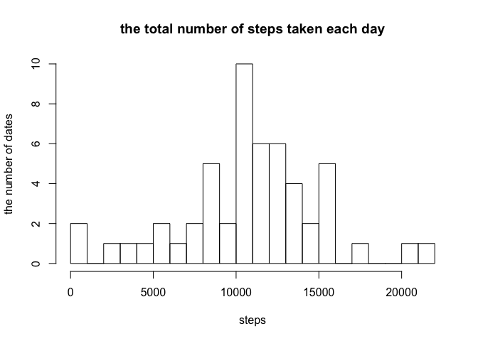

# Reproducible Research: Peer Assessment 1


## Loading and preprocessing the data


```r
activity <- read.csv("activity.csv")
```


## What is mean total number of steps taken per day?

1. Calculate the total number of steps taken per day


```r
df <- aggregate(steps~date, activity, sum)
head(df)
```

```
##         date steps
## 1 2012-10-02   126
## 2 2012-10-03 11352
## 3 2012-10-04 12116
## 4 2012-10-05 13294
## 5 2012-10-06 15420
## 6 2012-10-07 11015
```


2. Make a histogram of the total number of steps taken each day.

```r
hist(df$steps,main="the total number of steps taken each day", xlab="steps", ylab="the number of dates",breaks=20)
```

 

Note : Ignored missing values!!

3.Calculate and report the mean and median of the total number of steps taken per day


```r
mean_step <- mean(df$steps)
median_step <- median(df$steps)

mean_step
```

```
## [1] 10766.19
```

```r
median_step
```

```
## [1] 10765
```


## What is the average daily activity pattern?

1. Make a time series plot (i.e. type = "l") of the 5-minute interval (x-axis) and the average number of steps taken, averaged across all days (y-axis)


```r
df2<- aggregate(steps~interval,activity,mean)
head(df2)
```

```
##   interval     steps
## 1        0 1.7169811
## 2        5 0.3396226
## 3       10 0.1320755
## 4       15 0.1509434
## 5       20 0.0754717
## 6       25 2.0943396
```

```r
library(ggplot2)
g <- ggplot(df2, aes(interval, steps))
g <-g + geom_line() + labs(title="the average number of steps")
print(g)
```

 

2. Which 5-minute interval, on average across all the days in the dataset, contains the maximum number of steps?


```r
 df2[which.max(df2$steps),]
```

```
##     interval    steps
## 104      835 206.1698
```


## Imputing missing values

1. Calculate and report the total number of missing values in the dataset (i.e. the total number of rows with NAs)


```r
sum(is.na(activity))
```

```
## [1] 2304
```

2. Devise a strategy for filling in all of the missing values in the dataset. The strategy does not need to be sophisticated. For example, you could use the mean/median for that day, or the mean for that 5-minute interval, etc.

I will use the mean for that 5-minute intervals for the missing values.


3. Create a new dataset that is equal to the original dataset but with the missing data filled in.


```r
merged.activity <-merge(activity,df2,by="interval",suffixes=c("",".mean"))
idx <- is.na(merged.activity$steps)
merged.activity$steps[idx]<-merged.activity$steps.mean[idx]
merged.activity<-merged.activity[order(merged.activity$date,merged.activity$interval),]
head(merged.activity)
```

```
##     interval     steps       date steps.mean
## 1          0 1.7169811 2012-10-01  1.7169811
## 63         5 0.3396226 2012-10-01  0.3396226
## 128       10 0.1320755 2012-10-01  0.1320755
## 205       15 0.1509434 2012-10-01  0.1509434
## 264       20 0.0754717 2012-10-01  0.0754717
## 327       25 2.0943396 2012-10-01  2.0943396
```

4. Make a histogram of the total number of steps taken each day and Calculate and report the mean and median total number of steps taken per day. Do these values differ from the estimates from the first part of the assignment? What is the impact of imputing missing data on the estimates of the total daily number of steps?


```r
df3 <- aggregate(steps~date, merged.activity, sum)
head(df3)
```

```
##         date    steps
## 1 2012-10-01 10766.19
## 2 2012-10-02   126.00
## 3 2012-10-03 11352.00
## 4 2012-10-04 12116.00
## 5 2012-10-05 13294.00
## 6 2012-10-06 15420.00
```

```r
hist(df3$steps,main="the total number of steps taken each day", xlab="steps", ylab="the number of dates",breaks=20)
```

 

```r
mean_step3 <- mean(df3$steps)
median_step3<- median(df3$steps)
mean_step3
```

```
## [1] 10766.19
```

```r
median_step3
```

```
## [1] 10766.19
```

```r
mean_step - mean_step3
```

```
## [1] 0
```

```r
median_step - median_step3
```

```
## [1] -1.188679
```

The impact of the missing values seems low. The mean of the new data is the same as the old one but the median of the new data is a little bit greater than the old one.


## Are there differences in activity patterns between weekdays and weekends?

1. Create a new factor variable in the dataset with two levels – “weekday” and “weekend” indicating whether a given date is a weekday or weekend day.


```r
merged.activity$newdate <- as.POSIXlt(merged.activity$date,format="%Y-%m-%d")
merged.activity$day <- "Weekday"
merged.activity$day[weekdays(merged.activity$newdate) %in% c("Saturday","Sunday")] <-"Weekend"
head(merged.activity)
```

```
##     interval     steps       date steps.mean    newdate     day
## 1          0 1.7169811 2012-10-01  1.7169811 2012-10-01 Weekday
## 63         5 0.3396226 2012-10-01  0.3396226 2012-10-01 Weekday
## 128       10 0.1320755 2012-10-01  0.1320755 2012-10-01 Weekday
## 205       15 0.1509434 2012-10-01  0.1509434 2012-10-01 Weekday
## 264       20 0.0754717 2012-10-01  0.0754717 2012-10-01 Weekday
## 327       25 2.0943396 2012-10-01  2.0943396 2012-10-01 Weekday
```


2. Make a panel plot containing a time series plot (i.e. type = "l") of the 5-minute interval (x-axis) and the average number of steps taken, averaged across all weekday days or weekend days (y-axis). See the README file in the GitHub repository to see an example of what this plot should look like using simulated data.


```r
df4<- aggregate(steps~interval+day,merged.activity,mean)
head(df4)
```

```
##   interval     day      steps
## 1        0 Weekday 2.25115304
## 2        5 Weekday 0.44528302
## 3       10 Weekday 0.17316562
## 4       15 Weekday 0.19790356
## 5       20 Weekday 0.09895178
## 6       25 Weekday 1.59035639
```

```r
library(ggplot2)
g <- ggplot(df4, aes(interval, steps))
g <-g + geom_line()  +facet_wrap(~day,nrow=2)
print(g)
```

 
